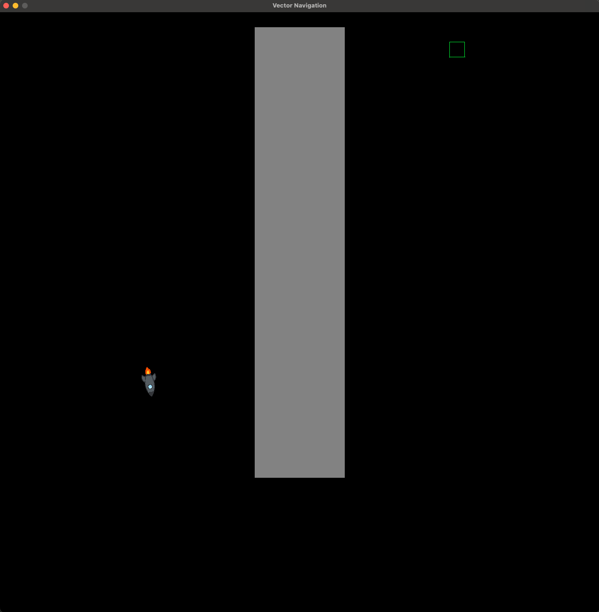

# Vector Rocket Game

## Description
A 2D vector-based rocket game inspired by ENG2005 concepts. Uses concepts such as velocitym acceleration, drag, and direction control.

## Project Motivation
This project was made as part of a self designed learning series to reinforce ENG2005 learning concepts through pracical C programming and interactive simulation.

This helps as solving through more than paper, it allows visualisations of vector motions on a dynamic environment.

## Core Maths and Physics Concepts
- **Position Update**
    x(t+Δt) = x(t) + v(t) * Δt
- **Velocity Update**
    v(t+Δt) = v(t) + a(t) * Δt
- **Acceleration Model**
    a = T - c * v

Where:
- T is the thrust vector controlled by keyboard input
- c * v represents linear drag opposing motion
- All quantities are treated as 2D vectors

Rocket orientation is computed from velocity vector using:

θ = atan2(v.y, v.x)

This ensures rendered rocket rotates according to its actual trajectory.

## Key Technical Challenges
- Designing a clean separation between physics, game logic, input and rendering
- Refactoring terminal-based rendering to raylib-based graphical renderer
- Computing orientation from velocity rather than input direction
- Managing configuration parameters safely using version control
- Learning Git workflows for experimentation and rollback

## Controls
- ** W / A / S / D ** : Apply thrust in four directions
- ** Shift ** : Boost thrust
- ** Close Window ** : Exit Game

## Screenshots

<br>

## Build/Flash

``` bash
make clean
make
./build/main
```

## Tools and Technologies
- C (modular design)
- raylib (graphics and input)
- macOs and Terminal

## Project structure
- main.c : Program entry point and main loop
- game.c : Game state and high-level logic
- physics.c : Vector physics and motion equations
- object_list.c : 2D vector math utilities
- render_raylib.c : Graphical rendering using raylib
- input.c : Keyboard input handling
- vector2.c : Object management using linked lists
- assets/rocket.png : Rocket texture